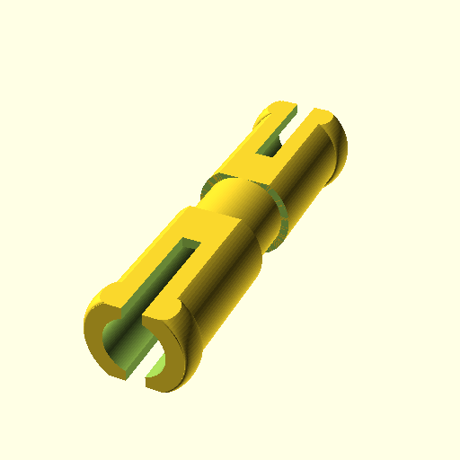
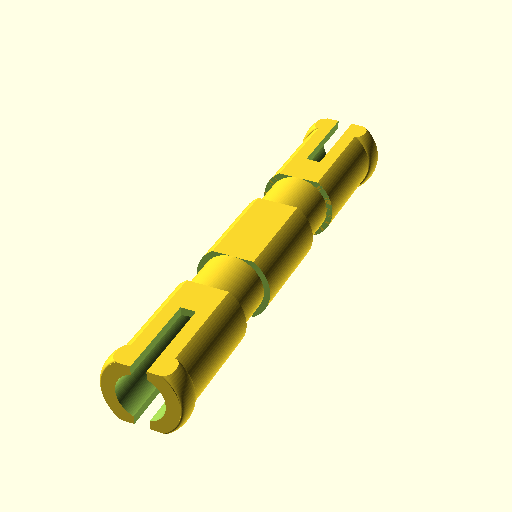
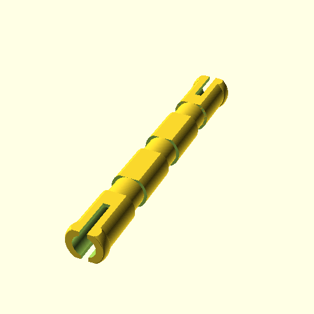
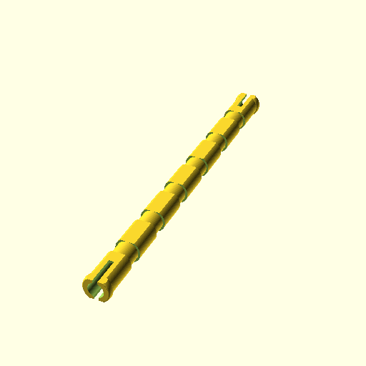
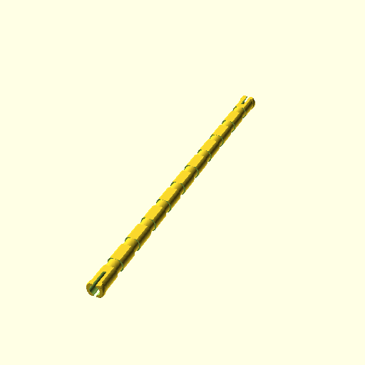
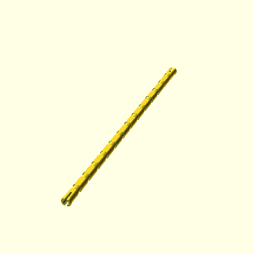
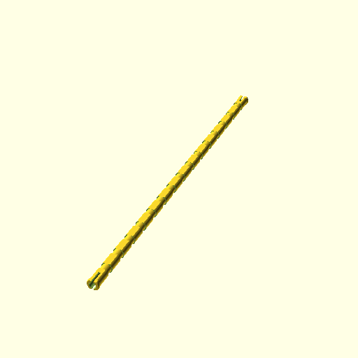
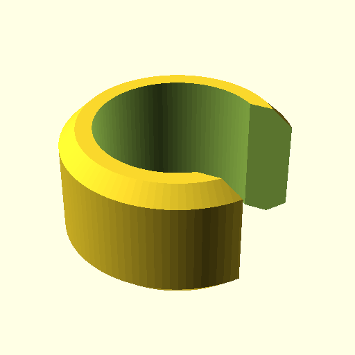
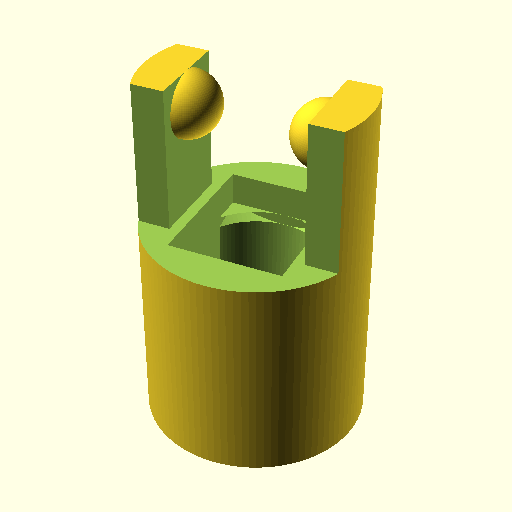
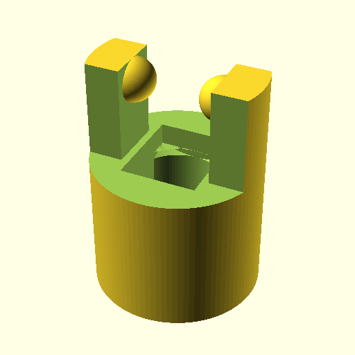

## kbricks axles

STL file name | Image
--------------|------
axle2.stl | 
axle3.stl | 
axle4.stl | 
axle5.stl | 
axle6.stl | 
axle7.stl | 
axle8.stl | 
axle9.stl | 
axle10.stl | 
axle11.stl | 
axle12.stl | 
axle13.stl | 
axle14.stl | 
axle15.stl | 
axle16.stl | 
axle_ring.stl | 
cardan_joint.stl | 
cardan_cube.stl | 
cardan_joint_thick.stl | 
