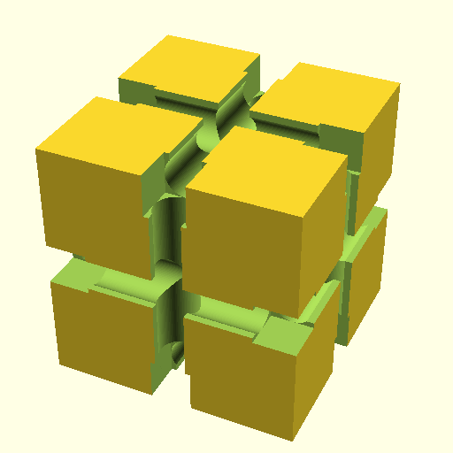
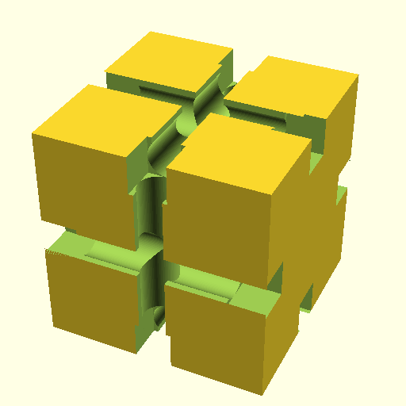
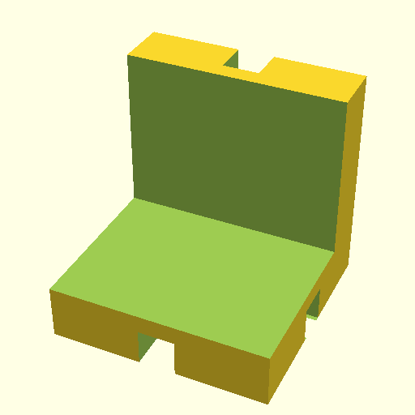
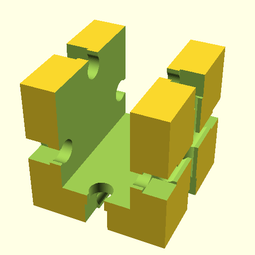
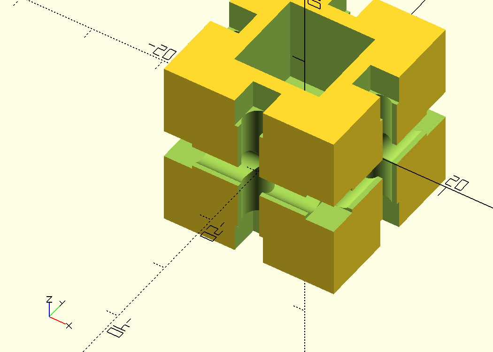
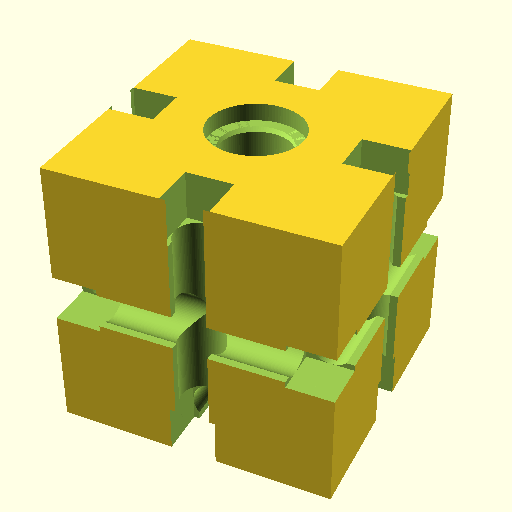
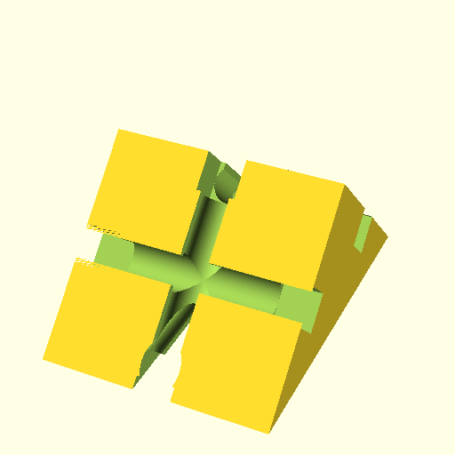
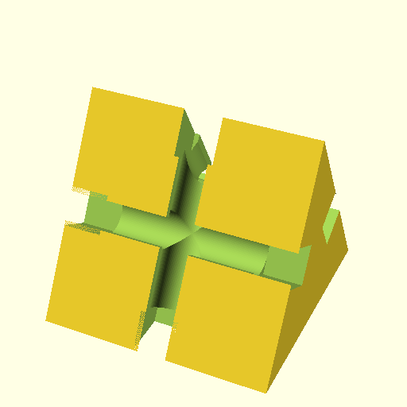

## kbricks cubes

STL file name | Image
--------------|------
cube_basic.stl | 
cube_smooth.stl | 
cube_l.stl | 
cube_u.stl | 
cube_1hole_open.stl | 
cube_1hole.stl | 
cube_2hole.stl | 
prism_45deg.stl | 
prism_60deg.stl | 
