## kbricks gears

STL file name | Image
--------------|------
gear1.stl | 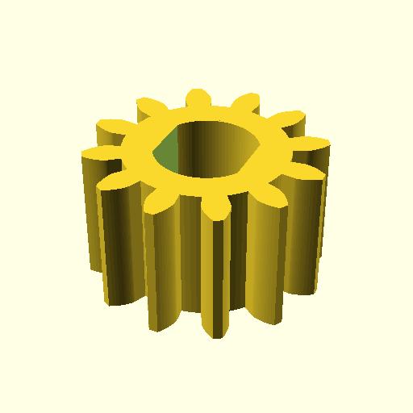
gear2.stl | 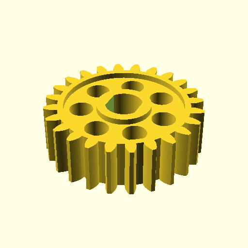
gear3.stl | 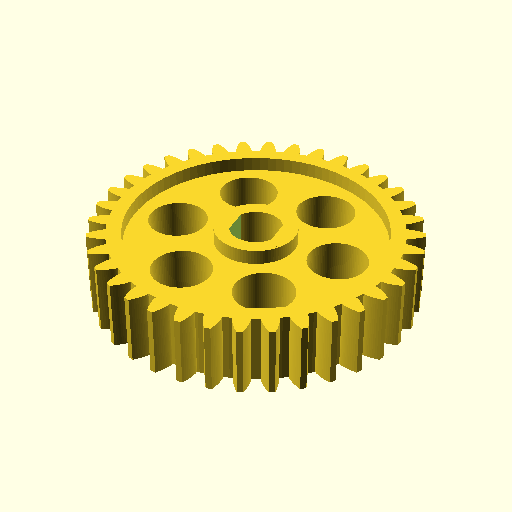
gear4.stl | 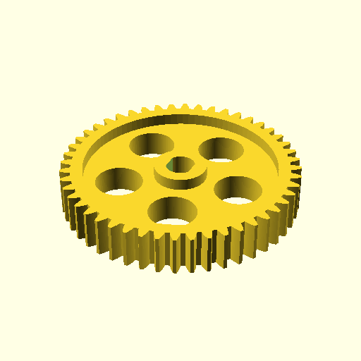
gear5.stl | 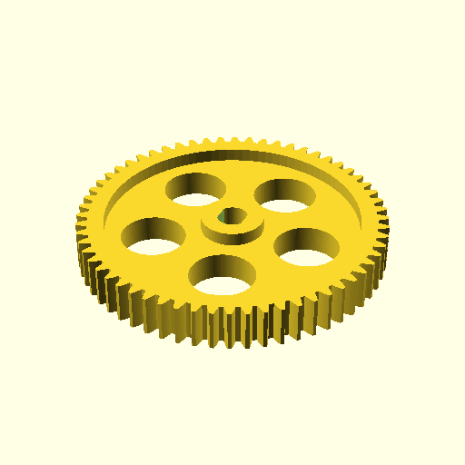
bevel_gear_60deg.stl | 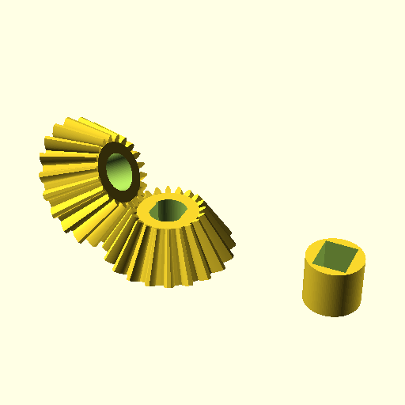
bevel_gear_90deg.stl | 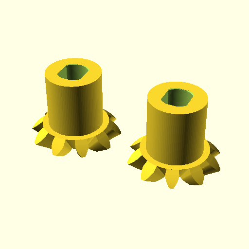
bevel_gear_90deg_short.stl | 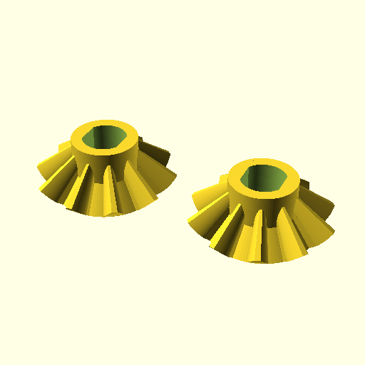
gear_rack4.stl | 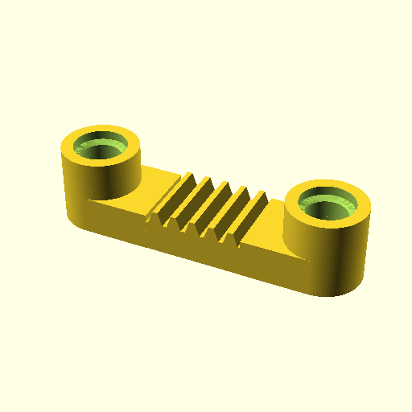
gear_rack5.stl | 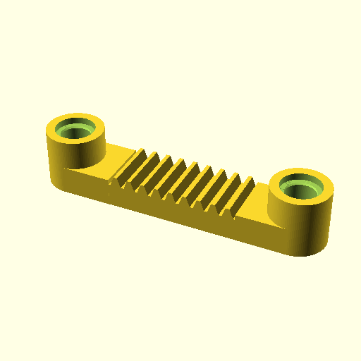
gear_rack6.stl | 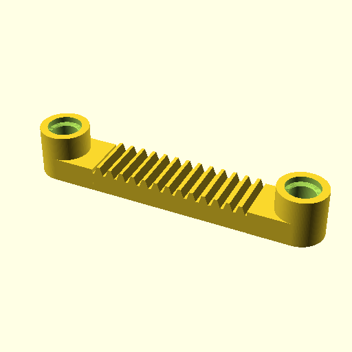
gear_rack7.stl | 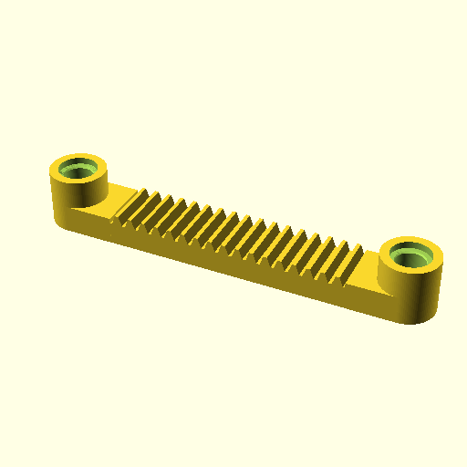
gear_rack8.stl | 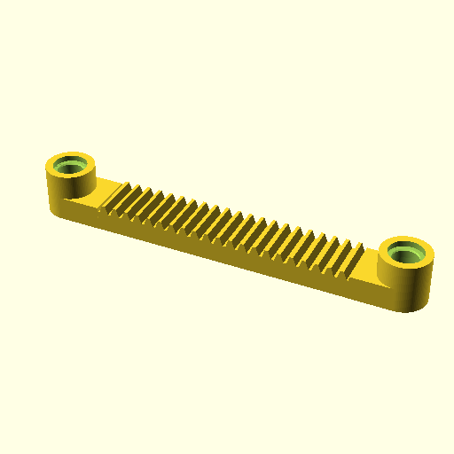
gear_rack9.stl | 
gear_rack10.stl | 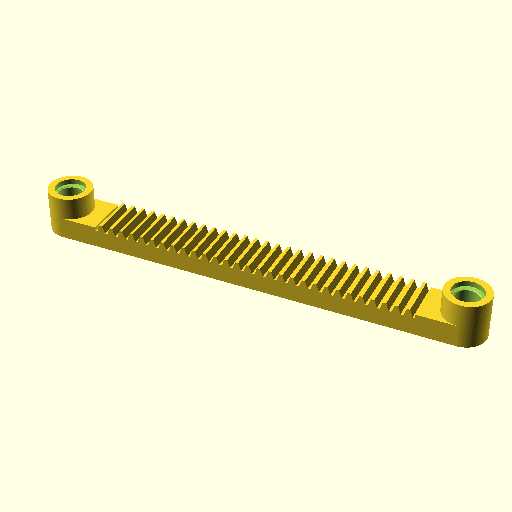
gear_rack11.stl | 
gear_rack12.stl | 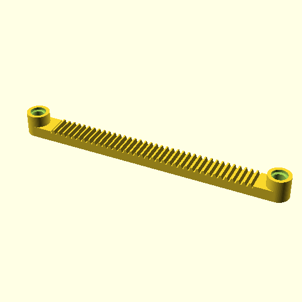
gear_rack13.stl | 
gear_rack14.stl | 
gear_rack15.stl | 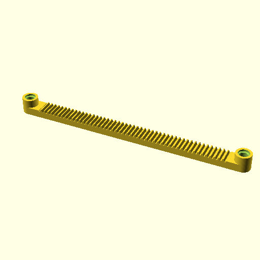
gear_rack16.stl | 
Not available in repository. Generate from scad source. | 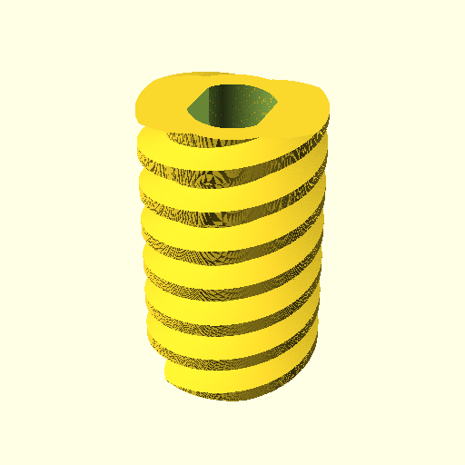
Not available in repository. Generate from scad source. | 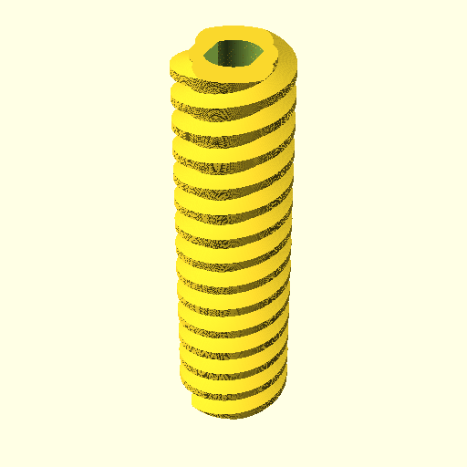
Not available in repository. Generate from scad source. | 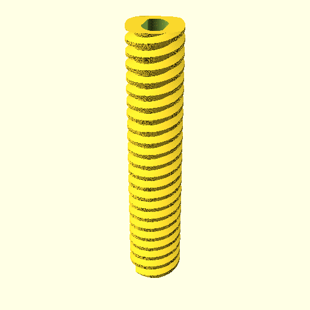
worm_block.stl | 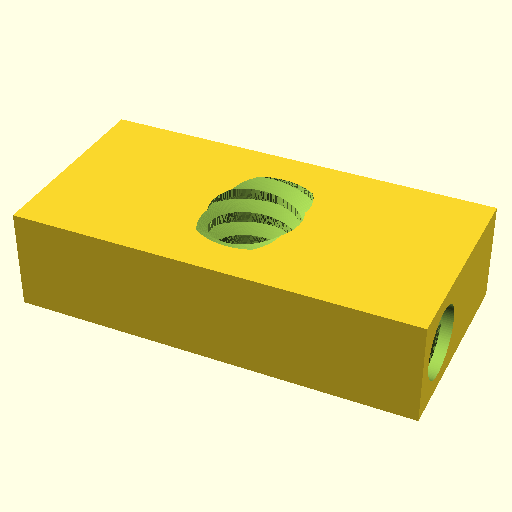
